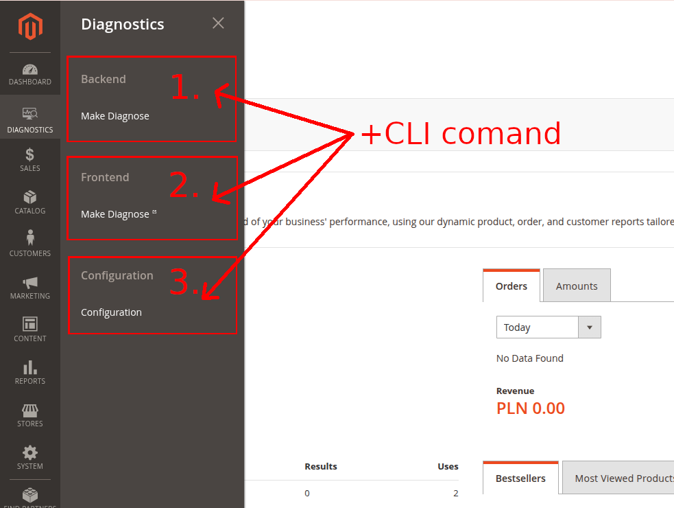
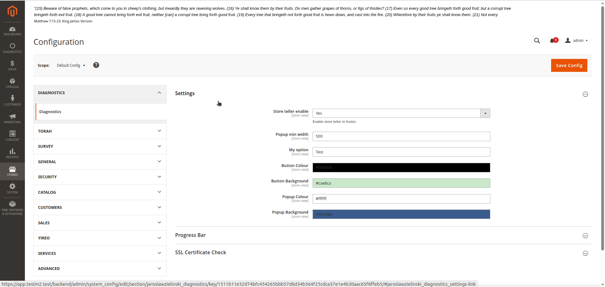
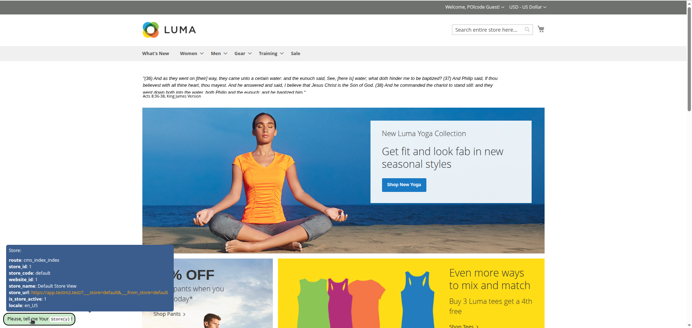

# Diagnostics-M2
a diagnostic module in magento2 project that can be used as a scaffolding for Your new code.

[](https://www.buymeacoffee.com/jaroslawzielinski)

## Why do you need this module in Your Project?

### Introduction

Have you ever needed to...

* ...test/debug a part of Your code using separate controller in the backend area?
* ...test/debug a part of Your code using separate controller in the frontend area?
* ...test/change something in the database really quick using shell command?
* ...test some of Your frontend work like js/css/html in some separate place of the project and keep it there for some time?
* ...fix something in the project for some reason only locally and you did not know where to put it?
* ...do any from the above issues plus having dedicated configuration for it?
* ...do any from the above issues plus having the changes only in local env without repo modification?

If Your answer is yes for any of these, and additionally You recall it happend more then once or it happens often, please acknowledge that this diagnostic module is for You and is for free.

It will help You in Your work and You will find it usefull in any kind of magento2 project.

### Overall idea of the module

You will install the core module via composer require --dev call. This way this module will not be in repo in the production mode.

You will override the core module by your own Vendor_Diagnostics module (The core module is only the basis for Your Custom Code added to Vendor_Diagnostics module).

You will add all of Your changes to .git/info/exclude if you are a git user:

```shell
echo "app/code/Vendor/Diagnostics/" >> .git/info/exclude
```

### What do You gain by using the Diagnostic Module?

You will have an easy way to test/debug backend controller (1.), frontend controller in new tab (2.) and view/edit Your dedicated configuration (3.) in the admin panel from the menu. You may do it all from one place, without affecting the repo (You may change Your branches, and the module will stay there, all the time unaffected...). See the screenshot below:



Also you have a CLI command that you may use/modify whatever way You like:

```shell
bin/magento jaroslawzielinski:diagnostics:test --help
```

or after overriding **getName** and **getDescription** methods you may use e.g. this way:
```shell
bin/magento vendor:diagnostics:customer --help
```

## How to install the Diagnostic Module via shell (1 Step out of 3)
in [packagist](https://packagist.org/packages/jaroslawzielinski/diagnostics-m2)
```shell
cd YourProject
composer require --dev jaroslawzielinski/diagnostics-m2
```

## How to override the core module by Your Custom Code (2 Step out of 3):

### Create a module (see [docs/module.zip](docs/module.zip)):

#### Vendor/Diagnostics/registration.php

```php
<?php

declare(strict_types=1);

\Magento\Framework\Component\ComponentRegistrar::register(
    \Magento\Framework\Component\ComponentRegistrar::MODULE,
    'Vendor_Diagnostics',
    __DIR__
);

```

#### Vendor/Diagnostics/etc/module.xml

```xml
<?xml version="1.0"?>
<config xmlns:xsi="http://www.w3.org/2001/XMLSchema-instance" 
    xsi:noNamespaceSchemaLocation="urn:magento:framework:Module/etc/module.xsd">
    <module name="Vendor_Diagnostics">
        <sequence>
            <module name="JaroslawZielinski_Diagnostics"/>
        </sequence>
    </module>
</config>

```

### Override Admin Panel Configuration:

#### Vendor/Diagnostics/etc/adminhtml/system.xml

```xml
<?xml version="1.0"?>
<config xmlns:xsi="http://www.w3.org/2001/XMLSchema-instance"
    xsi:noNamespaceSchemaLocation="urn:magento:module:Magento_Config:etc/system_file.xsd">
    <system>
        <section id="jaroslawzielinski_diagnostics">
            <!-- TODO: add/modify Your way... -->
            <group id="settings">
                <field id="my_option" translate="label comment" type="text" sortOrder="20" showInDefault="1"
                    showInWebsite="1" showInStore="1">
                    <label>My option</label>
                </field>
            </group>
        </section>
    </system>
</config>

```

#### Vendor/Diagnostics/etc/config.xml

```xml
<config xmlns:xsi="http://www.w3.org/2001/XMLSchema-instance"
    xsi:noNamespaceSchemaLocation="urn:magento:module:Magento_Store:etc/config.xsd">
    <default>
        <jaroslawzielinski_diagnostics>
            <!-- TODO: add/modify Your way... -->
            <settings>
                <my_option><![CDATA[Test]]></my_option>
            </settings>
        </jaroslawzielinski_diagnostics>
    </default>
</config>

```

#### Vendor/Diagnostics/Model/Config.php

```php
<?php

declare(strict_types=1);

namespace Vendor\Diagnostics\Model;

use Magento\Store\Model\ScopeInterface;
class Config extends \JaroslawZielinski\Diagnostics\Model\Config
{
    public const PATH_SETTINGS_MY_OPTION = 'jaroslawzielinski_diagnostics/settings/my_option';

    //TODO: add Your constants here...

    public function getMyOption(): ?string
    {
        $myOption = $this->scopeConfig->getValue(self::PATH_SETTINGS_MY_OPTION, ScopeInterface::SCOPE_STORE);
        return empty($myOption) ? null : (string)$myOption;
    }

    //TODO: add Your Code here...
}

```

### Override Console Command:

#### Vendor/Diagnostics/etc/di.xml

```xml
<config xmlns:xsi="http://www.w3.org/2001/XMLSchema-instance"
    xsi:noNamespaceSchemaLocation="urn:magento:framework:ObjectManager/etc/config.xsd">
    <type name="Vendor\Diagnostics\Model\Test\Customer">
        <arguments>
            <argument name="logger" xsi:type="object">JaroslawZielinski\Diagnostics\Logger</argument>
        </arguments>
    </type>
    
    <preference for="JaroslawZielinski\Diagnostics\Model\Test\Test" type="Vendor\Diagnostics\Model\Test\Customer"/>
</config>

```

#### Vendor/Diagnostics/Model/Test/Customer.php

```php
<?php

declare(strict_types=1);

namespace Vendor\Diagnostics\Model\Test;

use JaroslawZielinski\Diagnostics\Model\Test\Test;
use Magento\Customer\Api\CustomerRepositoryInterface;
use Magento\Framework\Exception\LocalizedException;
use Magento\Framework\Exception\NoSuchEntityException;
use Psr\Log\LoggerInterface;
use Symfony\Component\Console\Input\InputArgument;
use Symfony\Component\Console\Output\OutputInterface;

class Customer extends Test
{
    /**
     * @var CustomerRepositoryInterface
     */
    private $customerRepository;

    /**
     * {@inheritDoc}
     *
     * TODO: add Your DI
     */
    public function __construct(
        CustomerRepositoryInterface $customerRepository,
        LoggerInterface $logger
    ) {
        parent::__construct($logger);
        $this->customerRepository = $customerRepository;
    }

    /**
     * {@inheritDoc}
     *
     * TODO: add Your code here... (this is only an example)
     */
    public function execute(array $input, OutputInterface $output): array
    {
        $customerId = $input['customer_id'] ?? null;
        try {
            $customer = $this->customerRepository->getById($customerId);
            $email = $customer->getEmail();
        } catch (NoSuchEntityException|LocalizedException $e) {
            $this->logger->error($e->getMessage(), $e->getTrace());
            return [
                __('Something went wrong [message: %1]', $e->getMessage())
            ];
        }
        $output->writeln('OK');
        $this->logger->info('Customer Input', [
            'customer_id' => $customerId,
            'email' => $email
        ]);
        return [
            __('Done. [customer_id: %1, email: %2]', $customerId, $email)
        ];
    }

    /**
     * @inheritDoc
     */
    public function getArgumentsDefinition(): array
    {
        return [
            [
                'name' => 'customer_id',
                'mode' => InputArgument::REQUIRED,
                'description' => (string)__('Customer ID'),
                'default' => null
            ]
        ];
    }

    /**
     * @inheritDoc
     */
    public function getName(): string
    {
        return 'vendor:diagnostics:customer';
    }

    /**
     * @inheritDoc
     */
    public function getDescription(): string
    {
        return 'Vendor Diagnostics customer';
    }
}

```

### Override Controller Adminhtml Test:

#### Vendor/Diagnostics/etc/adminhtml/events.xml

```xml
<config xmlns:xsi="http://www.w3.org/2001/XMLSchema-instance"
    xsi:noNamespaceSchemaLocation="urn:magento:framework:Event/etc/events.xsd">
    <event name="adminhtml_diagnostics_controller_test">
        <observer name="vendor_adminhtml_diagnostics_controller_test"
            instance="Vendor\Diagnostics\Observer\Adminhtml\Test"/>
    </event>
</config>

```

#### Vendor/Diagnostics/Observer/Adminhtml/Test.php

```php
<?php

declare(strict_types=1);

namespace Vendor\Diagnostics\Observer\Adminhtml;

use JaroslawZielinski\Diagnostics\Model\Console\Output as ConsoleOutput;
use JaroslawZielinski\Diagnostics\Console\Command\Test as TestCommand;
use Magento\Framework\App\Request\Http;
use Magento\Framework\Event\Observer;
use Magento\Framework\Event\ObserverInterface;
use Symfony\Component\Console\Exception\ExceptionInterface;
use Symfony\Component\Console\Input\ArrayInput;

class Test implements ObserverInterface
{
    /**
     * @var ConsoleOutput
     */
    private $output;
    
    /**
     * @var TestCommand
     */
    private $testCommand;

    /**
     * TODO: Your DI here...
     */
    public function __construct(
        ConsoleOutput $output,
        TestCommand $testCommand
    ) {
        $this->output = $output;
        $this->testCommand = $testCommand;
    }

    /**
     * @inheritDoc
     */
    public function execute(Observer $observer)
    {
        $event = $observer->getEvent();
        /** @var Http $request */
        $request = $event->getRequest();

        //TODO: Your Code here to test in backend controller
        $customerId = 1;
        $input = new ArrayInput(['customer_id' => $customerId]);
        $this->testCommand->run($input, $this->output);

        /** @var array $result */
        $result = $event->getResult();

        //TODO: Log the results here
        $result['test'] = 123;
        $event->setResult($result);
    }
}

```

#### Vendor/Diagnostics/Block/Adminhtml/Test.php

```php
<?php

declare(strict_types=1);

namespace Vendor\Diagnostics\Block\Adminhtml;

use Vendor\Diagnostics\Model\Config;
use Magento\Backend\Block\Template\Context;
use Magento\Directory\Helper\Data as DirectoryHelper;
use Magento\Framework\Json\Helper\Data as JsonHelper;

class Test extends \JaroslawZielinski\Diagnostics\Block\Adminhtml\Test
{
    /**
     * {@inheritDoc}
     *
     * TODO: add Your DI
     */
    public function __construct(
        Config $config,
        Context $context,
        array $data = [],
        ?JsonHelper $jsonHelper = null,
        ?DirectoryHelper $directoryHelper = null
    ) {
        parent::__construct($config, $context, $data, $jsonHelper, $directoryHelper);
    }

    public function getMyOption(): ?string
    {
        return $this->config->getMyOption();
    }

    //TODO: add Your Code here...
}

```

#### Vendor/Diagnostics/view/adminhtml/layout/jaroslawzielinski_diagnostics_diagnose_test.xml

```xml
<?xml version="1.0"?>
<page xmlns:xsi="http://www.w3.org/2001/XMLSchema-instance"
    xsi:noNamespaceSchemaLocation="urn:magento:framework:View/Layout/etc/page_configuration.xsd">
    <!-- TODO: override Your way... -->
    <body>
        <referenceContainer name="content">
            <block class="Vendor\Diagnostics\Block\Adminhtml\Test" name="admin_test_block"
                template="Vendor_Diagnostics::diagnose/test.phtml"/>
        </referenceContainer>
    </body>
</page>

```

#### Vendor/Diagnostics/view/adminhtml/templates/diagnose/test.phtml

```php
<?php
    /** @var \Vendor\Diagnostics\Block\Adminhtml\Test $block */
    // TODO: override Your way...
?>
<span><?= __('This is Vendor test [my_option: %1].', $block->getMyOption()); ?></span>
<br />
<?= $this->getChildHtml(); ?>

```

### Override Controller Test:

#### Vendor/Diagnostics/etc/frontend/events.xml

```xml
<config xmlns:xsi="http://www.w3.org/2001/XMLSchema-instance"
    xsi:noNamespaceSchemaLocation="urn:magento:framework:Event/etc/events.xsd">
    <event name="diagnostics_controller_test">
        <observer name="vendor_diagnostics_controller_test"
            instance="Vendor\Diagnostics\Observer\Test"/>
    </event>
</config>

```

#### Vendor/Diagnostics/Observer/Test.php

```php
<?php

declare(strict_types=1);

namespace Vendor\Diagnostics\Observer;

use Magento\Framework\App\Request\Http;
use Magento\Framework\Event\Observer;
use Magento\Framework\Event\ObserverInterface;

class Test implements ObserverInterface
{
    /**
     * TODO: Your DI here...
     */
    public function __construct()
    {
    }

    /**
     * @inheritDoc
     */
    public function execute(Observer $observer)
    {
        $event = $observer->getEvent();
        /** @var Http $request */
        $request = $event->getRequest();

        //TODO: Your Code here to test in frontend controller

        /** @var array $result */
        $result = $event->getResult();

        //TODO: Log the results here
        $result['test'] = 234;
        $event->setResult($result);
    }
}

```

#### Vendor/Diagnostics/Block/Test.php

```php
<?php

declare(strict_types=1);

namespace Vendor\Diagnostics\Block;

use Vendor\Diagnostics\Model\Config;
use Magento\Framework\View\Element\Template\Context;

class Test extends \JaroslawZielinski\Diagnostics\Block\Test
{
    /**
     * {@inheritDoc}
     *
     * TODO: add Your DI
     */
    public function __construct(
        Config $config,
        Context $context,
        array $data = []
    ) {
        parent::__construct($config, $context, $data);
    }

    public function getMyOption(): ?string
    {
        return $this->config->getMyOption();
    }

    //TODO: add Your Code here...
}

```

#### Vendor/Diagnostics/view/frontend/layout/jaroslawzielinski_diagnostics_diagnose_test.xml

```xml
<?xml version="1.0"?>
<page xmlns:xsi="http://www.w3.org/2001/XMLSchema-instance" layout="empty"
    xsi:noNamespaceSchemaLocation="urn:magento:framework:View/Layout/etc/page_configuration.xsd">
    <!-- TODO: override Your way... -->
    <body>
        <referenceContainer name="content">
            <block class="Vendor\Diagnostics\Block\Test" name="test_block"
                template="Vendor_Diagnostics::diagnose/test.phtml" />
        </referenceContainer>
    </body>
</page>

```

#### Vendor/Diagnostics/view/frontend/templates/diagnose/test.phtml

```php
<?php
    /** @var \Vendor\Diagnostics\Block\Test $block */
    // TODO: override Your way...
?>
<span><?= __('This is Vendor test [my_option: %1].', $block->getMyOption()); ?></span>
<br />
<?= $this->getChildHtml(); ?>

```

## Hide Your Custom Code from git (3 Step out of 3)

```shell
echo "app/code/Vendor/Diagnostics/" >> .git/info/exclude
```

Modify Your Vendor/Diagnostics module, add Your code there, use X Debug and...

## ...Enjoy Your coding!

## One more usefull feature for Multistore
A little helper saying store details. Feature helping to acknowlege the Store parameters like route, name, id, code, locale and others.
Available indicators:
* route (&lt;route name&gt;&lowbar;&lt;controller name&gt;&lowbar;&lt;action name&gt;)
* store_id
* store_code
* website_id
* store_name
* store_url
* is_store_active
* locale

### Backend Configuration

### Frontend



## Another features added:
* Command ``jaroslawzielinski:customer-without-password:create``
* Command ``jaroslawzielinski:associated-products:find``
* Command ``jaroslawzielinski:ssl-certificates:check`` with configuration in **Admin Panel**
